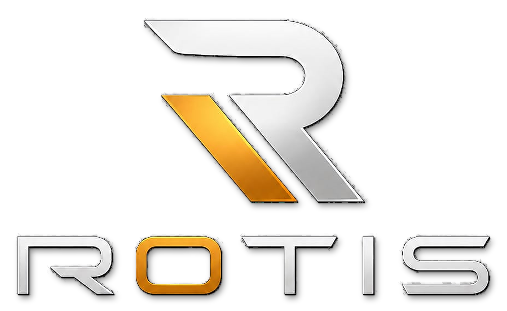

<div align="center">



# ROTIS — Rotis Tech (Private) Limited

**Fourth Industrial Revolution in Hospitality**


</div>

---

## 📖 Overview

This repository contains the official corporate website and portfolio of **Rotis Tech (Private) Limited**. It serves a dual purpose:

1. **Corporate portal** — showcasing the company's vision and its flagship product, **ROTIS**, an AI-powered restaurant operations platform.
2. **Founder portfolio** — a professional portfolio for the company's CEO and owner, **Usman Yaseen**.

| | |
|---|---|
| **Project Name** | ROTIS |
| **Developed By** | dotwasi |
| **CEO & Owner** | Usman Yaseen |
| **License** | Proprietary — All Rights Reserved |

---

## ✨ Features

- 🏠 **10 fully routed pages** — Home, About, ROTIS Solution, Portfolio & Impact, Tech Stack, Core Services, AI Expertise, Acclaim, Contact, and Trial/Demo
- 🤖 **AI integration** — live AI insights powered by the Google Gemini API
- 📋 **Market-research survey** — multi-question survey modal captured via Netlify Forms
- 📬 **Contact form** — serverless form handling through Netlify Forms
- 💬 **WhatsApp button** — floating instant-contact button on every page
- 🎨 **Modern dark UI** — custom brand theme, smooth animations with Framer Motion
- 📊 **Data visualization** — interactive charts built with Recharts
- 📱 **Fully responsive** — mobile-first design with Tailwind CSS

---

## 🛠️ Tech Stack

| Layer | Technology | Version |
|---|---|---|
| **UI Framework** | [React](https://react.dev) | ^18.2.0 |
| **Language** | [TypeScript](https://www.typescriptlang.org) | ^5.2.2 |
| **Build Tool** | [Vite](https://vitejs.dev) | ^5.2.0 |
| **Styling** | [Tailwind CSS](https://tailwindcss.com) | ^3.4.3 |
| **Routing** | [React Router DOM](https://reactrouter.com) (HashRouter) | ^6.23.1 |
| **Animations** | [Framer Motion](https://www.framer.com/motion) | ^11.2.10 |
| **Charts** | [Recharts](https://recharts.org) | ^2.12.7 |
| **AI** | [@google/generative-ai](https://www.npmjs.com/package/@google/generative-ai) (Gemini 1.5 Flash) | ^0.12.0 |
| **Email** | [@emailjs/browser](https://www.emailjs.com) | ^4.3.3 |
| **CSS Processing** | PostCSS + Autoprefixer | ^8.4.38 / ^10.4.19 |
| **Forms/Hosting** | [Netlify](https://www.netlify.com) (Netlify Forms) | — |

---

## 📋 Requirements

| Requirement | Minimum Version | Check With |
|---|---|---|
| [Node.js](https://nodejs.org) | v18.0.0 or newer | `node -v` |
| npm (bundled with Node.js) | v9 or newer | `npm -v` |
| Git | any recent version | `git --version` |
| Google Gemini API key | — | [Get one here](https://aistudio.google.com/app/apikey) |

---

## 🚀 Getting Started

### 1. Clone the repository

```bash
git clone https://github.com/<your-username>/rotis-tech-website.git
cd rotis-tech-website
```

### 2. Install dependencies

```bash
npm install
```

### 3. Configure environment variables

Create a file named `.env.local` in the project root:

```env
VITE_GEMINI_API_KEY=your_google_gemini_api_key_here
```

> ⚠️ Never commit `.env.local` to version control. It is already excluded by `.gitignore`.

### 4. Start the development server

```bash
npm run dev
```

The site will be available at **http://localhost:5173**.

---

## 📜 Available Scripts

| Command | Description |
|---|---|
| `npm run dev` | Start the Vite development server with hot reload |
| `npm run build` | Create an optimized production build in `dist/` |
| `npm run preview` | Serve the production build locally for testing |

---

## 📂 Project Structure

```
rotis-tech-website/
├── index.html                  # HTML entry point + hidden Netlify form definitions
├── package.json                # Dependencies and scripts
├── vite.config.ts              # Vite configuration
├── tailwind.config.js          # Tailwind theme (brand colors, fonts)
├── postcss.config.js           # PostCSS plugins
├── tsconfig.node.json          # TypeScript config for Node tooling
├── public/
│   ├── assets/                 # Logos (PNG/SVG)
│   ├── documents/              # CV, certificates, transcripts (PDF)
│   └── images/                 # Page and service imagery
└── src/
    ├── main.tsx                # React entry point
    ├── App.tsx                 # Route definitions (HashRouter)
    ├── index.css               # Global styles + Tailwind directives
    ├── components/
    │   ├── Layout.tsx          # Page shell (Header + Footer + Outlet)
    │   ├── Header.tsx          # Navigation bar
    │   ├── Footer.tsx          # Footer
    │   ├── SurveyModal.tsx     # Market-research survey (Netlify Forms)
    │   ├── Survey.css          # Survey styles
    │   └── WhatsAppButton.tsx  # Floating WhatsApp contact button
    ├── pages/                  # One component per route (10 pages)
    └── services/
        └── geminiService.ts    # Google Gemini AI integration
```

---

## 🌐 Deployment

The site is designed for **Netlify** (required for the contact and survey forms to work):

1. Push the repository to GitHub — see [GITHUB_UPLOAD_GUIDE.md](GITHUB_UPLOAD_GUIDE.md).
2. In Netlify: **Add new site → Import an existing project → GitHub** and select the repo.
3. Build settings — Build command: `npm run build`, Publish directory: `dist`.
4. Add the environment variable `VITE_GEMINI_API_KEY` under **Site settings → Environment variables**.
5. Deploy. Netlify automatically detects the hidden forms in `index.html` and provisions the form backend.

> The app uses **HashRouter**, so it also works on static hosts such as GitHub Pages without redirect rules — but Netlify Forms features only work on Netlify.

---

## 📚 Documentation

- [DOCUMENTATION.md](DOCUMENTATION.md) — full technical documentation (architecture, pages, components, services, forms)
- [GITHUB_UPLOAD_GUIDE.md](GITHUB_UPLOAD_GUIDE.md) — step-by-step guide to uploading this project to GitHub

---

## 📄 License & Copyright

**Copyright © 2026 Rotis Tech (Private) Limited. All Rights Reserved.**

This is proprietary software. Unauthorized copying, modification, distribution, or use of this software, via any medium, is strictly prohibited without prior written permission. See [LICENSE](LICENSE) for details.

---

<div align="center">

**Project:** ROTIS &nbsp;|&nbsp; **Developed by:** dotwasi &nbsp;|&nbsp; **CEO & Owner:** Usman Yaseen

</div>
